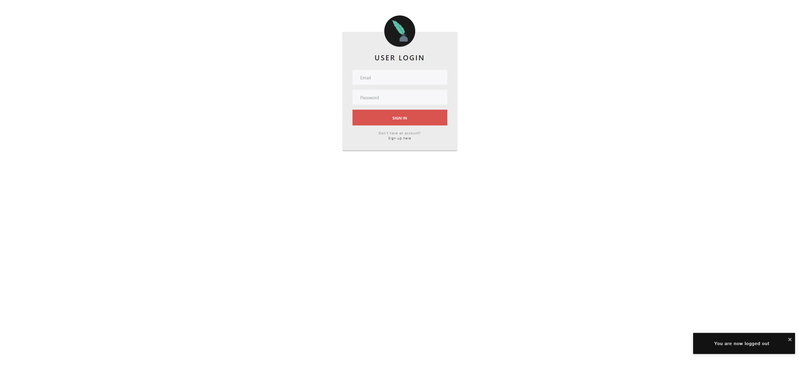
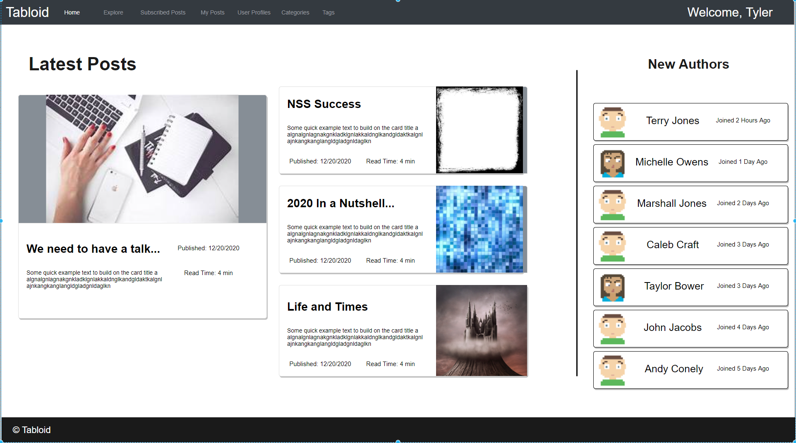
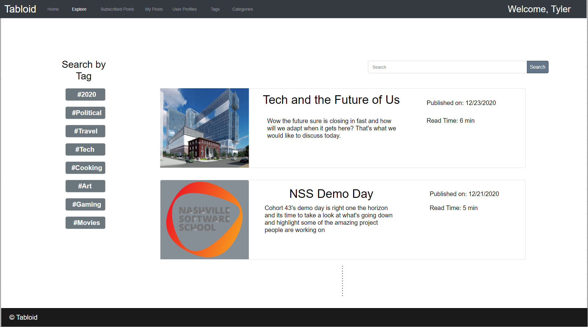
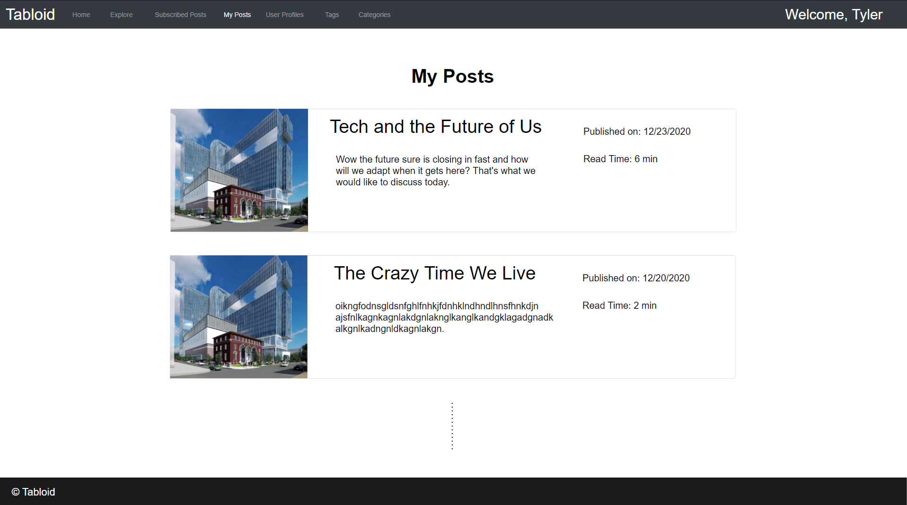
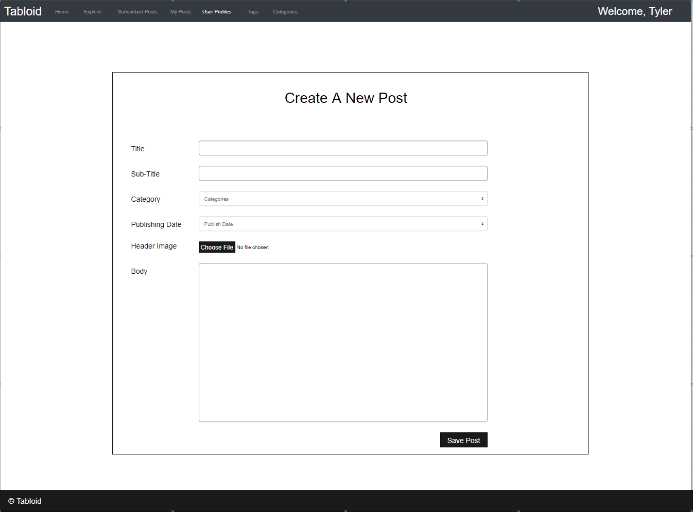
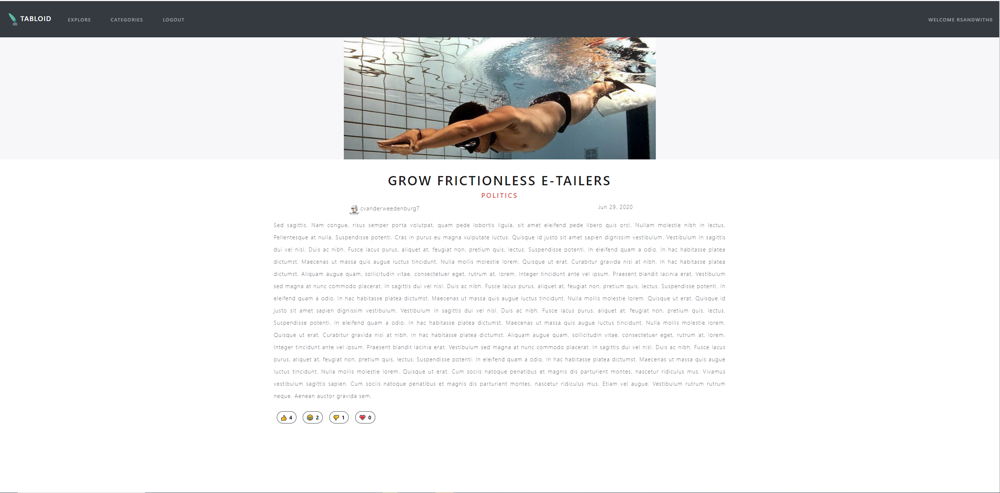
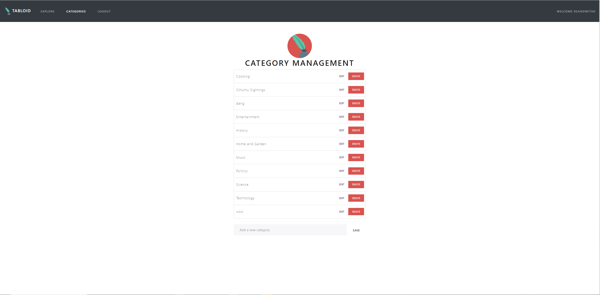

# Tabloid Full Stack Group Project

For this group project, you will be building an online content management system for anyone who would like to create an account and publish article on the Web for public consumption.

## Setup

1. In the top-level directory of the cloned project on your computer, run `dotnet user-secrets init`
1. Run `dotnet user-secrets set AdminPassword password` (you can choose a different password if you wish)
1. Run `dotnet user-secrets set TabloidDbConnectionString 'Host=localhost;Port=5432;Username=postgres;Password=password;Database=Tabloid'`
1. Run `dotnet restore`
1. Run `dotnet build`
1. Run `dotnet ef migrations add InitialCreate`
1. Run `dotnet ef database update`
1. Run `cd client`
1. Run `npm install`

## Test the Setup

1. Start debugging the API and run `npm start` in the `client` directory.
1. You should see the login view when the UI opens.
1. Attempt to login with `admina@strator.comx` and the password you set the value of `AdminPassword` to in the user-secrets
1. If the setup succeeded, you should see a welcome message, and a `User Profiles` menu option along with a logout button.

## Mock-Ups

The company has hired a designer and here are the mock-ups they provided.

> **NOTE:** Styling should **_NOT_** be prioritized over functionality. UI/UX **is** important, but it's more important that you focus on the code.

> **NOTE:** (The quill logo seen in some of the mockups is provided for you inside of the images folder along with the other mock-ups to use as needed!)

### Colors

These are the hex codes for the colors used in the mockups

* Red: `#db534b`
* Grey: `#6c767d`
* Black: `#343a40`
* Green: `#5bb8a6`

### Login Page

### Home Page

### Explore Page

### Your Post's Page

### Create Post Form

### Post Details Page

### Category List Page

